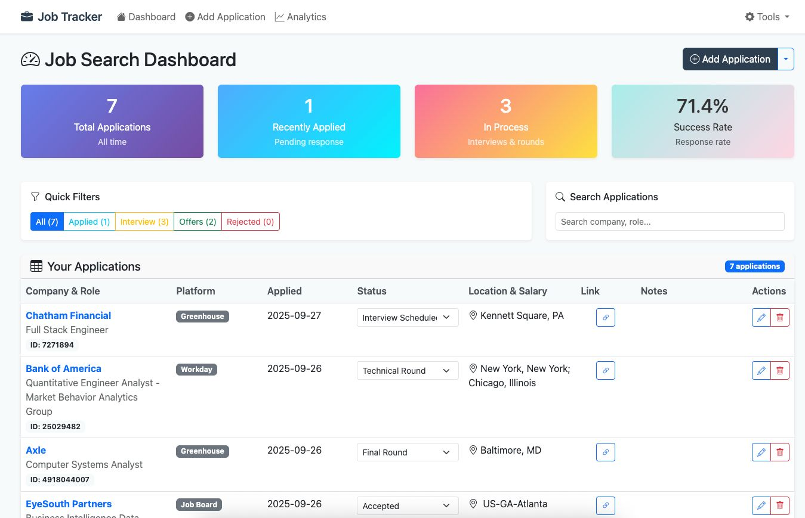
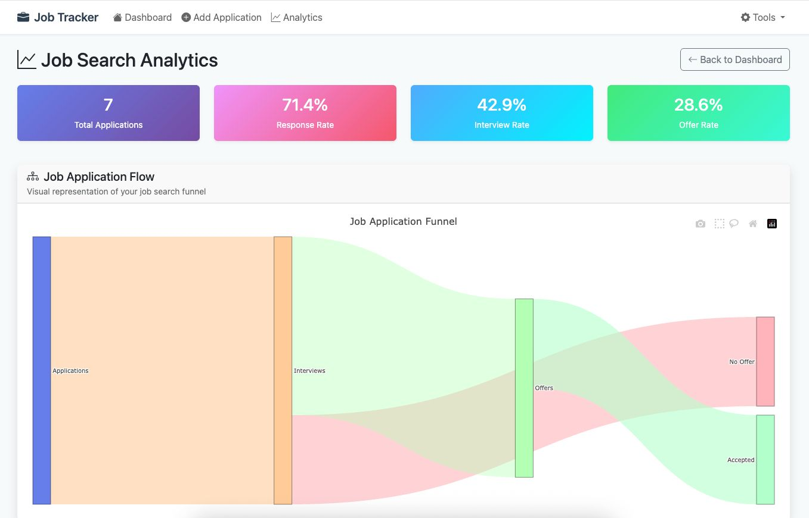
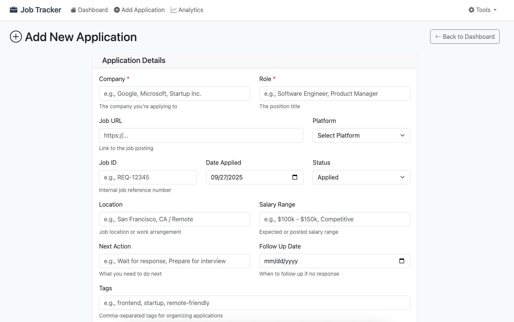
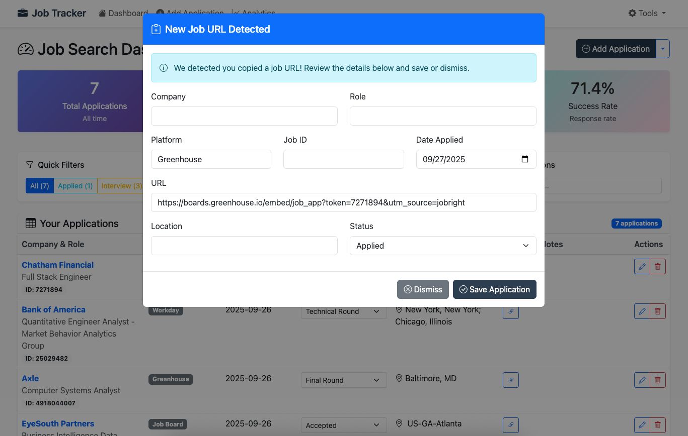

# Job Tracker - Smart Application Management System

A privacy-focused job application tracking system that automates data entry and provides powerful analytics for job seekers.

## Features

### Core Functionality
- **Local SQLite Database** - All data stored securely on your machine
- **Smart URL Detection** - Automatically detects job URLs from 15+ platforms
- **Real-time Status Updates** - Update application statuses without page refreshes
- **Excel Integration** - Import existing spreadsheets and export your data
- **Follow-up Management** - Never miss important follow-up dates

### Intelligent Automation
- **Clipboard Monitoring** - Auto-creates application drafts when you copy job URLs
- **Platform Recognition** - Supports LinkedIn, Greenhouse, Lever, Workday, Indeed, AngelList, and more
- **Smart Data Extraction** - Automatically extracts company names, job IDs, and platform information from URLs
- **Web Scraping** - Enhanced data extraction including job titles, locations, and salary information (when available)
- **Draft Review System** - Review and edit auto-generated entries before saving

### Advanced Analytics
- **Sankey Flow Diagrams** - Visualize your job search funnel from applications to offers
- **Success Metrics** - Track response rates, interview conversion, and offer rates  
- **Platform Performance** - Identify which job boards work best for you
- **Timeline Analysis** - See your application activity patterns over time
- **Smart Insights** - Get personalized recommendations based on your data

### Organization Tools
- **11 Status Types** - From "Applied" to "Accepted" with everything in between
- **Tagging System** - Organize applications by company type, role, location, etc.
- **Advanced Search** - Find applications quickly by company or role name
- **Status Filtering** - Filter by Applied, Interview, Offers, Rejected, etc.
- **Comprehensive Notes** - Track interview feedback, salary negotiations, and more

## Quick Start

Ready to get started? Here's the fastest way:

1. **Activate the included virtual environment:**
   ```bash
   source job-tracker-env/bin/activate  # Mac/Linux
   job-tracker-env\Scripts\activate     # Windows
   ```

2. **Run the application:**
   ```bash
   python app.py
   ```

3. **Open your browser:**
   ```
   http://localhost:5001
   ```

That's it! The virtual environment already has all dependencies installed.

## Installation & Setup

### Python Environment Setup

Since Python 3.13+ requires isolated package environments, this repository includes a pre-configured virtual environment with all dependencies installed.

1. **Clone the repository:**
   ```bash
   git clone https://github.com/sruthi7sri/Job-Tracker-Smart-Application-Management-System.git
   cd Job-Tracker-Smart-Application-Management-System
   ```

2. **Activate the included virtual environment:**
   ```bash
   source job-tracker-env/bin/activate  # On Mac/Linux
   # or
   job-tracker-env\Scripts\activate     # On Windows
   ```

3. **Run the application:**
   ```bash
   python app.py
   ```

4. **Open your browser and navigate to:**
   ```
   http://localhost:5001
   ```

### Alternative Setup (if virtual environment has issues)

If you need to create a fresh virtual environment:

```bash
# Create new virtual environment
python3 -m venv job-tracker-env

# Activate it
source job-tracker-env/bin/activate  # Mac/Linux
# or
job-tracker-env\Scripts\activate     # Windows

# Install dependencies
pip install -r requirements.txt

# Run the app
python app.py
```

## How It Works

### 1. Automatic URL Detection
Copy any job URL from supported platforms:
```
https://linkedin.com/jobs/view/12345
https://company.greenhouse.io/jobs/67890
https://jobs.lever.co/company/position-name
```

### 2. Smart Data Extraction
The system automatically extracts:
- **Company name** (from URL patterns and web scraping)
- **Job ID** (from URL parameters) 
- **Job title** (via intelligent web scraping when available)
- **Location** (from job postings when accessible)
- **Platform** (LinkedIn, Greenhouse, etc.)
- **Application date** (today's date)

### 3. Review and Save
A modal popup appears with pre-filled information. Add the job title and any additional details, then save.

### 4. Track and Analyze
Use the dashboard to:
- Update application statuses
- View your application pipeline
- Analyze success patterns
- Get follow-up reminders

## Supported Platforms

| Platform | Company Extraction | Job ID Extraction | Notes |
|----------|-------------------|-------------------|--------|
| LinkedIn | ❌ | ✅ | Manual company entry required |
| Greenhouse | ✅ | ✅ | From subdomain pattern |
| Lever | ✅ | ❌ | From URL path |
| Workday | ✅ | ❌ | From URL path |
| Indeed | ❌ | ❌ | Platform detection only |
| AngelList | ❌ | ❌ | Platform detection only |
| Company Sites | ❌ | ❌ | Platform detection only |

## Screenshots

### Dashboard - Real-time Application Tracking


*Track all your applications in one place with real-time status updates, filtering, and comprehensive statistics*

### Analytics - Sankey Flow Visualization  


*Visualize your job search funnel with interactive Sankey diagrams and detailed analytics*

### Add Application - Smart Form


*Add new applications with smart form validation and status tracking*

### Clipboard Monitoring - Automatic Draft Creation


*Automatic draft creation when you copy job URLs - just review and save!*

## Add Application
![Form with auto-filled fields from clipboard monitoring]

*Screenshots coming soon - add actual images to showcase the interface*

## Tech Stack

**Backend:**
- Python 3.7+
- Flask web framework
- SQLite database
- Threading for background processing

**Frontend:**
- Bootstrap 5 for responsive UI
- Vanilla JavaScript for interactivity
- Plotly.js for data visualizations
- Bootstrap Icons

**Key Libraries:**
- `pyperclip` - Clipboard monitoring
- `openpyxl` - Excel file processing
- `flask` - Web framework
- No pandas dependency for Python 3.12+ compatibility

## Data Schema

```sql
CREATE TABLE applications (
    id INTEGER PRIMARY KEY AUTOINCREMENT,
    company TEXT NOT NULL,
    role TEXT NOT NULL,
    job_id TEXT,
    date_applied DATE DEFAULT CURRENT_DATE,
    status TEXT DEFAULT 'Applied',
    url TEXT UNIQUE,
    platform TEXT,
    location TEXT,
    salary TEXT,
    notes TEXT,
    tags TEXT,
    next_action TEXT,
    follow_up_on DATE,
    created_at TIMESTAMP DEFAULT CURRENT_TIMESTAMP,
    updated_at TIMESTAMP DEFAULT CURRENT_TIMESTAMP
);
```

## Privacy & Security

- **100% Local** - No cloud services or external APIs required
- **No Tracking** - No telemetry, analytics, or data collection
- **Offline Capable** - Works completely offline after initial setup
- **Your Data** - Complete control over your job search information
- **Open Source** - Transparent code you can audit and modify

## Installation Options

### Option 1: Direct Installation
```bash
pip install Flask pyperclip openpyxl
python app.py
```

### Option 2: Virtual Environment (Recommended)
```bash
python3 -m venv job-tracker-env
source job-tracker-env/bin/activate  # On Windows: job-tracker-env\Scripts\activate
pip install -r requirements.txt
python app.py
```

### Option 3: Using Startup Scripts
**Windows:**
```bash
# Double-click start.bat
start.bat
```

**Mac/Linux:**
```bash
chmod +x start.sh
./start.sh
```

## Usage Tips

### Maximize Automation
1. Keep the application running while job searching
2. Copy job URLs directly from job sites
3. Review auto-filled information before saving
4. Use tags consistently for better filtering

### Analytics Insights
- Check your response rate to optimize application strategy
- Identify which platforms work best for your field
- Track seasonal application patterns
- Monitor follow-up effectiveness

### Data Management
- Export to Excel monthly for backup
- Use tags like "remote", "startup", "big-tech" for organization  
- Set follow-up dates 1-2 weeks after applying
- Keep detailed notes for interview preparation

## System Requirements

- **Python:** 3.7 or higher (tested on 3.12)
- **Storage:** ~50MB for application and data
- **Memory:** ~100MB RAM during operation
- **Browser:** Any modern web browser
- **OS:** Windows, macOS, Linux

### Dependencies
- **Core:** Flask, pyperclip, openpyxl
- **Optional (Web Scraping):** requests, beautifulsoup4, lxml

**Installation Note:** For Python 3.8+, using a virtual environment is recommended due to PEP 668 (externally-managed-environment policy).

### Platform-Specific Notes

### Platform-Specific Notes

**macOS:**
- **Virtual environment recommended:** `python3 -m venv job-tracker-env && source job-tracker-env/bin/activate`
- **Port 5000 conflict:** AirPlay Receiver uses port 5000 - app uses 5001 by default
- **Permissions:** Grant clipboard and web access permissions when prompted
- **Run with:** `python app.py` (after activating virtual environment)

**Windows:**  
- **Virtual environment:** `python -m venv job-tracker-env && job-tracker-env\Scripts\activate`
- **Security:** Security warnings for clipboard access are normal
- **Run with:** `python app.py`

**Linux:**
- **Dependencies:** `sudo apt-get install xsel xclip` for clipboard support
- **Virtual environment:** `python3 -m venv job-tracker-env && source job-tracker-env/bin/activate`  
- **Run with:** `python3 app.py`

## Troubleshooting

### Common Issues

**"Module not found" error:**
```bash
# Create virtual environment and install dependencies
python3 -m venv job-tracker-env
source job-tracker-env/bin/activate
pip install -r requirements.txt
```

**Python 3.8+ "externally-managed-environment" error:**
```bash
# Use virtual environment (recommended approach)
python3 -m venv job-tracker-env
source job-tracker-env/bin/activate  # On Windows: job-tracker-env\Scripts\activate
pip install -r requirements.txt
python app.py
```

**Port 5001 in use (or macOS AirPlay conflict):**

On **macOS**, port 5000 is used by AirPlay Receiver. The app uses port 5001 by default.

If port 5001 is also in use:
```bash
# Kill processes using port 5001
lsof -ti:5001 | xargs kill -9
```

To disable AirPlay Receiver (frees up port 5000):
1. **System Settings** → **General** → **AirDrop & Handoff**
2. Turn off **AirPlay Receiver**

**Clipboard monitoring not working:**
- Grant clipboard permissions when prompted
- On Linux, install xsel or xclip: `sudo apt-get install xsel xclip`
- Restart application after permission changes

**Web scraping not working:**
- Web scraping is optional and respects robots.txt
- Some sites block automated requests - this is normal
- Job URLs still work for platform detection and manual entry
- Check console for "Web scraping capabilities enabled" message

**Database errors:**
```bash
# Check permissions and recreate database if needed
ls -la data/
rm -f data/jobtracker.sqlite3  # Remove corrupted database
python app.py  # Will recreate database automatically
```

## Contributing

This project demonstrates production-ready development practices:

### Development Standards
- Clean, documented code
- Error handling and input validation
- Cross-platform compatibility
- Security-conscious design

### Future Enhancements
- [ ] Email integration for automatic status updates
- [ ] Machine learning for success prediction
- [ ] Mobile companion app
- [ ] Team collaboration features
- [ ] Advanced reporting and exports
- [ ] Integration with job board APIs

## License

MIT License - see [LICENSE](LICENSE) file for details.

## Support

Having issues? Check the troubleshooting section above or:

1. Verify system requirements
2. Check file permissions in `data/` directory  
3. Test with a fresh virtual environment
4. Review browser console for JavaScript errors

Built for job seekers who value privacy and want data-driven insights into their application process.

---

**Star this repo if it helps with your job search!**